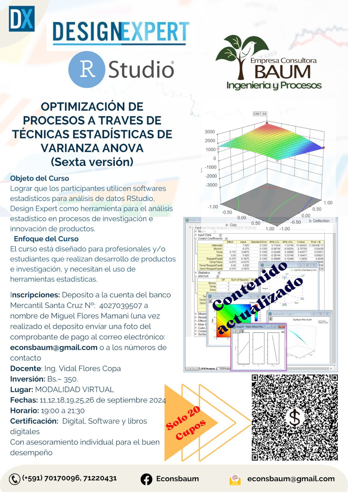
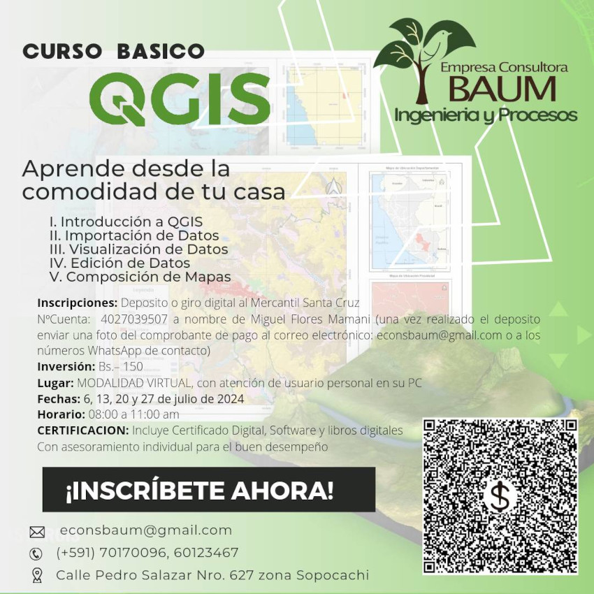

## Nuestras capacitaciones

Ofrecemos una amplia gama de cursos de capacitación en diversas áreas técnicas. Estos incluyen cursos en diseño experimental, simulación de procesos, análisis matemático y Sistemas de Información Geográfica (SIG). También proporcionamos formación especializada en seguridad industrial, primeros auxilios y la instalación de tableros eléctricos, brindando a los participantes las habilidades necesarias para operar con éxito en sus respectivos campos.

