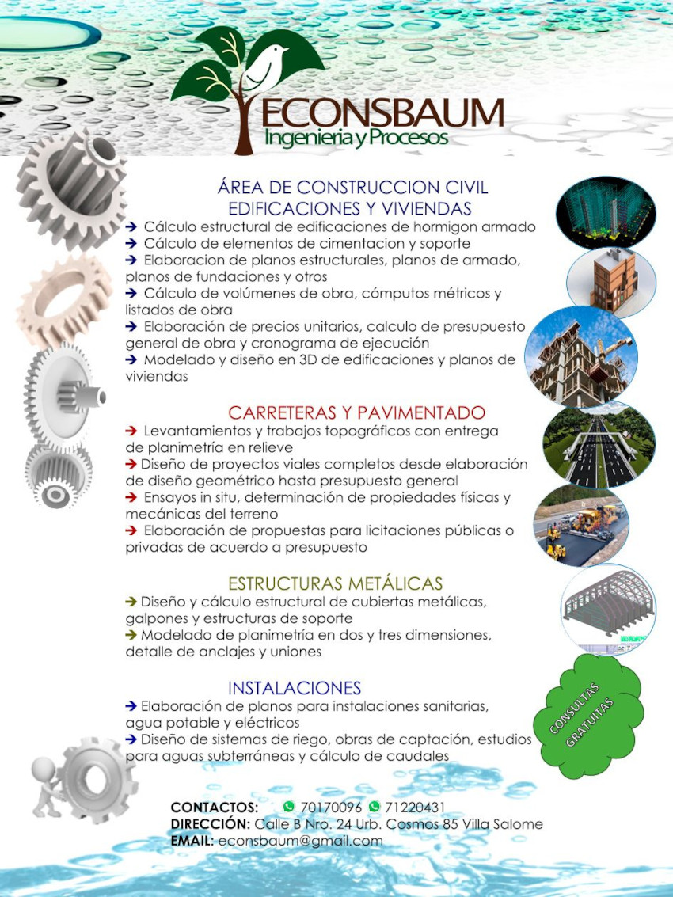

En el área de edificación y viviendas, ofrecemos servicios de cálculo estructural para edificaciones en hormigón armado, así como el cálculo preciso de volúmenes de obra y cómputos métricos. Elaboramos presupuestos generales de obra y supervisamos la ejecución de las mismas, asegurando la correcta estimación de recursos y la elaboración de planes de trabajo ajustados a los requerimientos del proyecto.

Para estructuras metálicas, diseñamos y calculamos la estructura de cubiertas metálicas, además de encargarnos de la construcción de galpones y otras estructuras de soporte. Nos ocupamos de la instalación de líneas de ventilación y gestionamos la estimación de recursos y la planificación del trabajo necesario para cada proyecto.