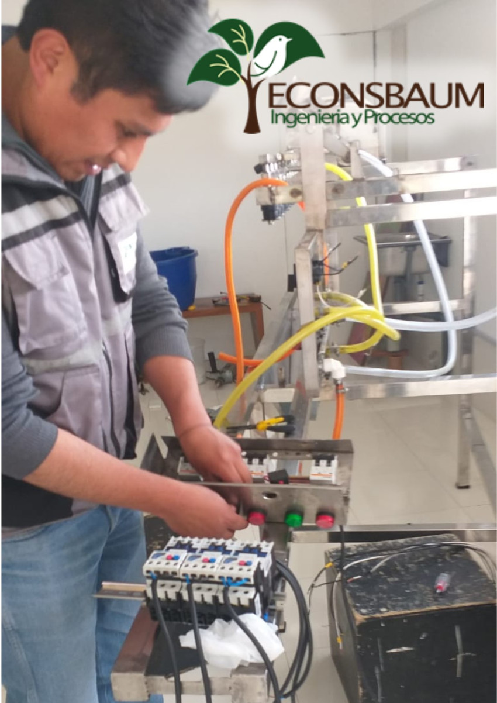

## Mejoramiento de procesos
Optimizamos los procesos industriales mediante el análisis y diseño de maquinaria especializada, utilizando programas avanzados para identificar y evaluar índices de mejora en la producción. Nuestro objetivo es maximizar la eficiencia y productividad de las operaciones industriales.

## Mantenimiento
Brindamos servicios de mantenimiento preventivo y correctivo de maquinaria, así como la evaluación de posibles mejoras en su funcionamiento. Elaboramos informes detallados para implementar mantenimiento predictivo y realizamos adecuaciones en los tableros eléctricos para optimizar el rendimiento de los equipos

## Instalaciones Eléctricas
Nos especializamos en el diseño e instalación de tableros de control para diversos tipos de instalaciones eléctricas. Garantizamos la correcta conexión y funcionamiento de equipos en alta y baja tensión, así como la revisión exhaustiva de las instalaciones eléctricas, asegurando su seguridad y eficiencia operativa.