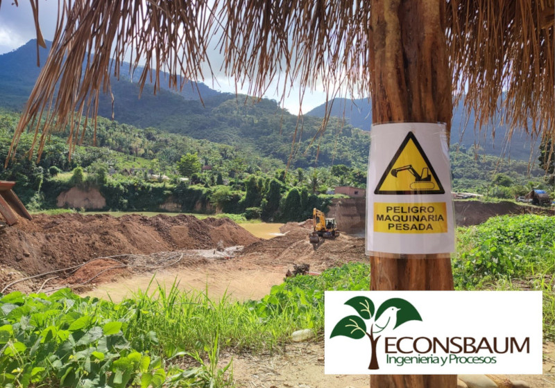

## Area legal
Ofrecemos asesoría legal especializada en el sector minero, incluyendo el asesoramiento para la elaboración y gestión de contratos mineros, trámites jurídicos para áreas mineras, y trámites ante entidades como AJAM, SENARECOM y COMIBOL. Además, gestionamos financiamiento a través de FOFIM y otras instituciones. También realizamos estimación de recursos mineros y elaboración de planes de trabajo que guían la operación minera.

## Area de Geologia
En el área de geología, nos especializamos en la identificación de vetas, mensura, cateo, análisis de muestras y mapeo geológico, brindando un diagnóstico preciso para la explotación minera. Además, ofrecemos servicios de estimación de recursos y elaboración de planes de trabajo adaptados a cada proyecto.

## Area Metalurgica
En el área metalúrgica, brindamos diagnósticos y evaluaciones completas de los procesos de trituración y molienda. Controlamos y analizamos las pruebas metalúrgicas para garantizar la eficiencia del proceso, además de realizar pruebas de lixiviación en columnas. También asesoramos en la selección, instalación y puesta en marcha de maquinaria y equipos mineros.

## Área Ambiental

Ofrecemos servicios integrales para la obtención de licencias ambientales para distintas categorías (EMAP, MA, EEIA) y brindamos asesoría para minimizar el impacto ambiental de los procesos industriales. Además, gestionamos trámites para el manejo de sustancias peligrosas y capacitamos a personal en temas de seguridad industrial. Implementamos Programas de Gestión de Seguridad y Salud en el Trabajo (PGSST) y elaboramos planes de trabajo en consonancia con las normativas ambientales.
